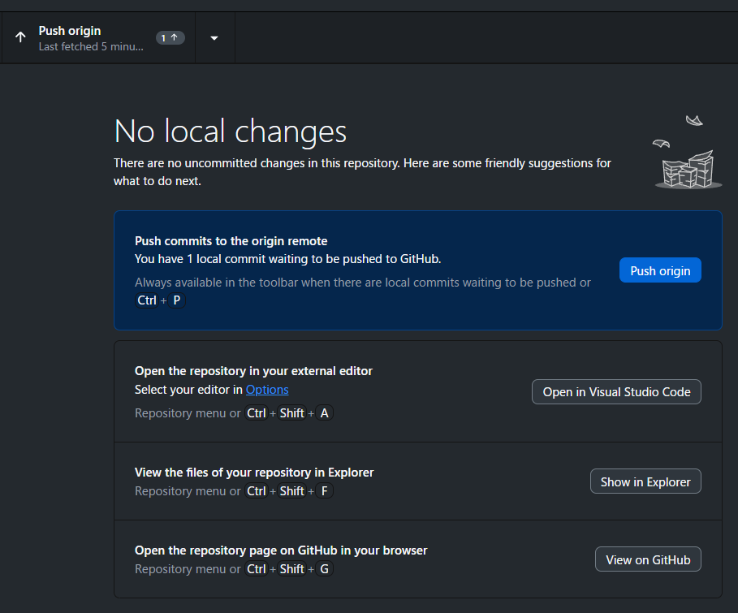

# 🟦 GitHub Desktop：プッシュガイド（Push Guide）

コミットした変更を GitHub（オンライン）に送る  
「Push」操作をまとめたガイド。

後継者が見ても迷わないように、  
操作手順・注意点・スクショ枠を含めて構成している。

---

## 📷 画面スクショ
※ ここにあなたが撮った「Push origin」画面のスクショを貼る  
（コミット後に自動で表示される）

---

## 📝 Push の基本

### Push とは？
- **PC でコミットした変更を GitHub に送る操作**
- GitHub Desktop ではコミット後に自動で Push ボタンが出る

---

## 🟦 Push の流れ

### 1. コミットが完了すると、左上に **Push origin** が表示される
- 例：  
  - `Push origin`  
  - `Push origin (1)` ← 1件のコミットが未送信

---

### 2. **Push origin** をクリック
- GitHub に変更が送信される  
- 数秒で完了する

---

### 3. Push 完了後の状態
- 左上が **Fetch origin** に戻る  
- これは「GitHub と同期している」状態

---

## 🟦 Push が必要なタイミング

- コミットしたあと  
- 新しいファイルを追加したあと  
- README を更新したあと  
- ガイドを追加したあと  
- 翻訳ファイルを編集したあと

あなたの作業では **ほぼ毎回 Push が必要**。

---

## 🟦 注意点（あなた専用メモ）

- Push しないと GitHub 上に反映されない  
- Push し忘れると後継者が最新の資料を見れない  
- オフライン時は Push できない（後でまとめてOK）  
- Push は何回しても問題ない（安全）

---

## 📷 追加スクショ枠

### Push origin のスクショ
（ここに貼る）

### Push 完了後の Fetch origin のスクショ
（ここに貼る）

---

以上が **プッシュ画面の完全ガイド**。

