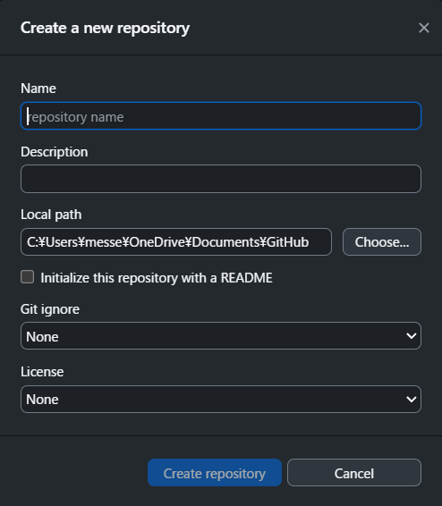
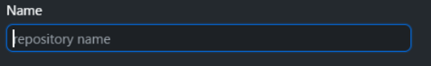

# GitHub Desktop 操作ガイド 一式（保存版）

このPDFは、GitHub Desktop の基本操作5つを
「推奨の読み順」で1冊にまとめた保存版です。

---

# 1. 新規リポジトリ作成（new-repo-guide）

```md
<< # 🟦 GitHub Desktop：新しいリポジトリ作成ガイド（New Repository）

  

GitHub Desktop で新しいリポジトリを作成するときの  

「どこに何を書くか」「どう入力するか」をまとめたガイド。

  

後継者が見ても理解できるように、  

入力例・注意点・スクショ枠を含めて構成している。

  

---

  

## 📷 画面スクショ

※ ここにあなたが撮ったスクショを貼る  

（GitHub Desktop → File → New Repository の画面）

  

---

  



  



  
  

## 📝 入力欄ガイド

  

### 1. **Name（リポジトリ名）**

- **意味**：プロジェクトの名前  

- **入力内容**：半角英数字（スペース不可）  

- **推奨形式**：`project-name`（ハイフン区切り）  

- **例**：  

  - `photo-organizer`  

  - `plant-database`  

  - `family-asset-system`

  

---

  

### 2. **Description（説明）**

- **意味**：プロジェクトの説明文  

- **入力内容**：日本語でOK  

- **例**：  

  - `植物写真を自動分類するツール`  

  - `家族資産管理システムのドキュメント`  

  - `GitHub Desktop の日本語マップ`

  

---

  

### 3. **Local Path（保存先フォルダ）**

- **意味**：PC 上の保存場所  

- **操作**：`Choose...` を押してフォルダを選ぶ  

- **推奨**：  

  - `C:/Users/charjee/Documents/GitHub/`  

  - `D:/Projects/`  

- **注意**：  

  - OneDrive 内は避ける（あなたの方針）  

  - 日本語フォルダ名は避けるとトラブルが少ない

  

---

  

### 4. **Initialize this repository with a README**

- **意味**：README.md を自動生成する  

- **推奨**：✔（チェックを入れる）  

- **理由**：  

  - GitHub 上で見やすくなる  

  - 後継者が理解しやすい  

  - 最初のコミットが作られる

  

---

  

### 5. **Git Ignore / License（任意）**

- **Git Ignore**：不要（後で追加可能）  

- **License**：不要（個人利用なら空でOK）

  

---

  

## 🟦 最後に押すボタン

  

### **Create Repository**

- **意味**：リポジトリを作成  

- **押すタイミング**：  

  - Name  

  - Local Path  

  - README  

  が設定できたら押す

  

---

  

## 🟦 作成後にやること（あなたの作業フロー）

  

1. GitHub Desktop 右上の **Open in VS Code** を押す  

2. VS Code で  

   - README.md  

   - 日本語マップ  

   - ガイド  

   を横に開く  

3. GitHub Desktop に戻って Commit → Push

  

---

  

## 🟦 注意点（あなた専用のメモ）

  

- OneDrive に保存しない（あなたの方針）  

- フォルダ名は英語に統一  

- README は必ず作る  

- 後継者が見ても理解できる構造にする  

  

---

  

## 📷 追加スクショ枠（必要に応じて）

  

### Name 入力欄のスクショ

（ここに貼る）

  

### Local Path のスクショ

（ここに貼る）

  

### README チェック欄のスクショ

（ここに貼る）

  

---

  

以上が **新しいリポジトリ作成画面の完全ガイド**。 >>

<< # 🟦 GitHub Desktop：リポジトリをクローンするガイド（Clone Repository）

  

GitHub 上の既存リポジトリを  

あなたの PC にコピー（クローン）する手順をまとめたガイド。

  

後継者が見ても迷わないように、  

入力欄の意味・操作手順・スクショ枠を含めて構成している。

  

---

  

## 📷 画面スクショ

※ ここにあなたが撮った「Clone a repository」画面のスクショを貼る  

（GitHub Desktop → File → Clone Repository）

  

---

  


  


  

## 📝 入力欄ガイド

  

### 1. **URL（Repository URL）**

- **意味**：クローンしたい GitHub リポジトリの URL  

- **入力内容**：GitHub の “Code” ボタンからコピーした URL  

- **例**：  

  - `https://github.com/charjee/photo-organizer.git`

  - `https://github.com/charjee/github-desktop-japanese-manual.git`

  

---

  

### 2. **Local Path（保存先フォルダ）**

- **意味**：PC 上の保存場所  

- **操作**：`Choose...` を押してフォルダを選ぶ  

- **推奨**：  

  - `C:/Users/charjee/Documents/GitHub/`  

  - `D:/Projects/`  

- **注意**：  

  - OneDrive 内は避ける（あなたの方針）  

  - 日本語フォルダ名は避けるとトラブルが少ない

  

---

  

### 3. **Clone ボタン**

- **意味**：クローン開始  

- **押すタイミング**：  

  - URL  

  - Local Path  

  が設定できたら押す

  

---

  

## 🟦 クローン後にやること（あなたの作業フロー）

  

1. GitHub Desktop が自動でリポジトリを読み込む  

2. 右上の **Open in VS Code** を押す  

3. VS Code で README や資料を確認  

4. 編集したら GitHub Desktop に戻って Commit → Push

  

---

  

## 🟦 注意点（あなた専用メモ）

  

- URL は必ず `.git` で終わる  

- 保存先は OneDrive を避ける  

- フォルダ名は英語に統一  

- クローン後は VS Code で資料を横に置くと作業が楽

  

---

  

## 📷 追加スクショ枠

  

### URL 入力欄のスクショ

（ここに貼る）

  

### Local Path のスクショ

（ここに貼る）

  

### Clone ボタンのスクショ

（ここに貼る）

  

---

  

以上が **クローン画面の完全ガイド**。

<< 🟦 GitHub Desktop：コミットの基本操作ガイド（Commit Guide）

GitHub Desktop で行う

「変更を記録する（コミット）」操作 をまとめたガイド。

後継者が見ても迷わないように、

操作手順・注意点・スクショ枠を含めて構成している。

  

📷 画面スクショ

※ ここにあなたが撮った「Commit to main」画面のスクショを貼る

（GitHub Desktop → 左側の変更一覧 → Summary → Commit to main）

  


  


  
  

📝 コミットとは？

•   変更を記録する操作

•   GitHub に送る前の “下書き保存” のようなもの

•   コミットしないと Push できない

•   後継者が変更内容を追跡できるようになる

  

🟦 コミットの流れ（基本操作）

1. 変更されたファイルを確認する

左側の Changes に変更されたファイルが一覧で表示される。

•   追加されたファイル

•   修正されたファイル

•   削除されたファイル

  

2. Summary（必須）を入力する

変更内容を一言で書く欄。

例：

•  

•  

•  

※ 後継者が見ても意味がわかる内容にする。

  

3. Description（任意）

必要なら詳細を書く。

例：

•  

•  

  

4. Commit to main を押す

これで変更が “main に記録される”。

  

🟦 コミット後にやること（Push）

コミットしただけでは GitHub に反映されない。

1.  左上に Push origin が表示される

2.  Push origin をクリック

3.  GitHub に変更が送信される

  

🟦 注意点（あなた専用メモ）

•   Summary は必ず書く（空欄だとコミットできない）

•   1 コミットは 1 つの目的にまとめると後継者が理解しやすい

•   コミット → Push の順番を忘れない

•   オフライン時はコミットだけしておいて、後で Push すればOK

  

📷 追加スクショ枠

Summary 入力欄のスクショ） >>


<< # 🟦 GitHub Desktop：プッシュガイド（Push Guide）

  

コミットした変更を GitHub（オンライン）に送る  

「Push」操作をまとめたガイド。

  

後継者が見ても迷わないように、  

操作手順・注意点・スクショ枠を含めて構成している。

  

---

  

## 📷 画面スクショ

※ ここにあなたが撮った「Push origin」画面のスクショを貼る  

（コミット後に自動で表示される）

  

---

  


  
  

## 📝 Push の基本

  

### Push とは？

- **PC でコミットした変更を GitHub に送る操作**

- GitHub Desktop ではコミット後に自動で Push ボタンが出る

  

---

  

## 🟦 Push の流れ

  

### 1. コミットが完了すると、左上に **Push origin** が表示される

- 例：  

  - `Push origin`  

  - `Push origin (1)` ← 1件のコミットが未送信

  

---

  

### 2. **Push origin** をクリック

- GitHub に変更が送信される  

- 数秒で完了する

  

---

  

### 3. Push 完了後の状態

- 左上が **Fetch origin** に戻る  

- これは「GitHub と同期している」状態

  

---

  

## 🟦 Push が必要なタイミング

  

- コミットしたあと  

- 新しいファイルを追加したあと  

- README を更新したあと  

- ガイドを追加したあと  

- 翻訳ファイルを編集したあと

  

あなたの作業では **ほぼ毎回 Push が必要**。

  

---

  

## 🟦 注意点（あなた専用メモ）

  

- Push しないと GitHub 上に反映されない  

- Push し忘れると後継者が最新の資料を見れない  

- オフライン時は Push できない（後でまとめてOK）  

- Push は何回しても問題ない（安全）

  

---

  

## 📷 追加スクショ枠

  

### Push origin のスクショ

（ここに貼る）

  

### Push 完了後の Fetch origin のスクショ

（ここに貼る）

  

---

  

以上が **プッシュ画面の完全ガイド**。 >>


<< # 🟦 GitHub Desktop：ブランチガイド（Branch Guide）

  

ブランチは「作業用の別ライン」。  

本番（main）を壊さずに作業したいときに使う。

  

後継者が見ても迷わないように、  

操作手順・用途・スクショ枠を含めて構成している。

  

---

  

## 📷 画面スクショ

※ ここにあなたが撮った「Current Branch」メニューのスクショを貼る  

（GitHub Desktop → 左上の Current Branch）

  

---

  


  


  

# 🟦 ブランチとは？

  

- **main を壊さずに作業するための “別の作業ライン”**  

- 大きな変更やテストをするときに使う  

- 完成したら main にマージする

  

あなたの作業では  

**基本は main だけでOK**  

だけど、後継者向けに説明を残しておく。

  

---

  

# 🟦 ブランチの基本操作

  

## ① 新しいブランチを作る

  

1. 左上の **Current Branch** をクリック  

2. **New Branch** を選ぶ  

3. 名前を入力  

   - 例：  

     - `fix-readme`  

     - `add-screenshots`  

     - `update-guide`  

4. **Create Branch** を押す

  

---

  

## ② ブランチを切り替える

  

1. **Current Branch** をクリック  

2. 一覧から切り替えたいブランチを選ぶ  

3. GitHub Desktop が自動で切り替える

  

---

  

## ③ main に戻る

  

1. **Current Branch** をクリック  

2. `main` を選ぶ  

3. 作業ラインが main に戻る

  

---

  

# 🟦 ブランチを使うタイミング（後継者向け）

  

- 大きな変更を試すとき  

- 本番に影響を出したくないとき  

- 他の人と同時に作業するとき  

- 新しい機能を試すとき

  

あなた（charjee）は  

**基本 main だけでOK**  

だけど、後継者がチームで作業する可能性を考えて残しておく。

  

---

  

# 🟦 注意点（あなた専用メモ）

  

- ブランチを作るときは main から作る  

- main に戻らず作業すると混乱する  

- ブランチ名は英語で短く  

- 後継者が見ても意味がわかる名前にする

  

---

  

## 📷 追加スクショ枠

  

### Current Branch のスクショ

（ここに貼る）

  

### New Branch のスクショ

（ここに貼る）

  

### ブランチ一覧のスクショ

（ここに貼る）

  

---

  

以上が **ブランチ画面の完全ガイド**。 >>
